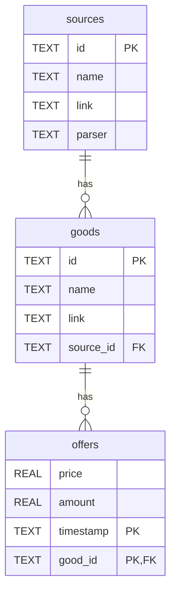

## Schema AgroData

### Table: sources
| Column | SQLite Type | Domain Type | Constraints |
|--------|-------------|------------|-------------|
| id | TEXT | uuid | PRIMARY KEY |
| name | TEXT | string | NOT NULL |
| link | TEXT | string | NOT NULL |
| parser | TEXT | Literal | NULL |

### Table: goods
| Column | SQLite Type | Domain Type | Constraints |
|--------|-------------|------------|-------------|
| id | TEXT | uuid | PRIMARY KEY |
| name | TEXT | string | NOT NULL |
| link | TEXT | string | NOT NULL |
| source_id | TEXT | uuid | NOT NULL, FOREIGN KEY → sources(id) |

### Table: offers
| Column | SQLite Type | Domain Type | Constraints |
|--------|-------------|------------|-------------|
| price | REAL | double | NOT NULL |
| amount | REAL | double | NOT NULL |
| timestamp | TEXT | timestamp | NOT NULL, часть составного PRIMARY KEY |
| good_id | TEXT | uuid | NOT NULL, часть составного PRIMARY KEY, FOREIGN KEY → goods(id) |

### Связи:
- `goods.source_id` → `sources.id` (many-to-one)
- `offers.good_id` → `goods.id` (many-to-one)

### Диаграмма:

### Примечания:
- **UUID**: В SQLite хранятся как TEXT (36 символов в формате `xxxxxxxx-xxxx-xxxx-xxxx-xxxxxxxxxxxx`)
- SQLite использует REAL для чисел с плавающей точкой
- **timestamp**: TEXT в формате ISO 8601 (`YYYY-MM-DD HH:MM:SS.SSS`)
- **Первичный ключ offers**: составной по полям `good_id` и `timestamp`
- Нужны индексы для внешних ключей для ускорения запросов